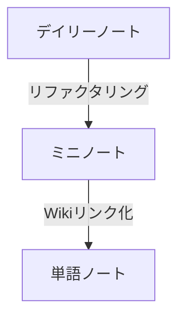

- まずその日の[デイリーノート]を立ち上げる
- [モーニングページ]
- [書く習慣]
- [楽しく書く]
- [ノンストップライティング]
- 1日の終わりではなく、思いついたら書いていく
- 直近の作業の見返しがしやすい
- [振り返り]を自然に行える

```mermaid
 graph TD
 A[デイリーノート]-->|リファクタリング|B[ミニノート]
 B-->|Wikiリンク化|C[単語ノート]
```