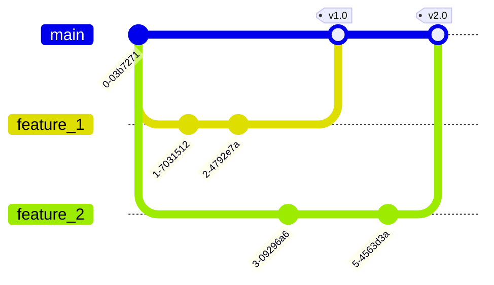

[[Github]]の[[ワークフロー]]

```mermaid
 gitGraph
    commit
    branch feature_1
    branch feature_2
    checkout feature_1
    commit
    commit
    checkout feature_2
    commit
    checkout main
    merge feature_1 tag: "v1.0"
    checkout feature_2
    commit
    checkout main
    merge feature_2 tag: "v2.0"
```