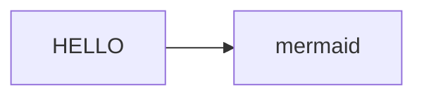

JavaScript製のダイアグラム生成ツール

[https://mermaid-js.github.io/mermaid/#/ mermaid - Markdownish syntax for generating flowcharts, sequence diagrams, class diagrams, gantt charts and git graphs.]

https://mermaid.js.org/

[[mermaid.js-用語集]]
[[mermaid.js-Glossary]]

[[mermaid.jsの使い方]]

[https://img.shields.io/badge/-mermaid-FF3670.svg?logo=mermaid&style=for-the-badge&logoColor=white]

