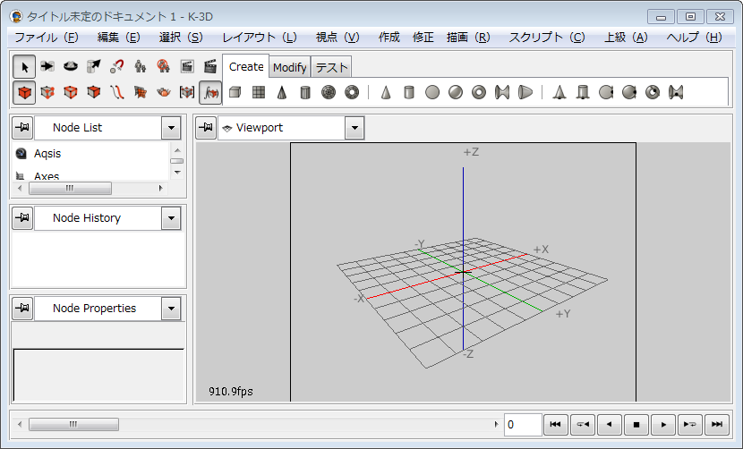

K-3D
====

本家

[K-3D | Seven Degrees of Freedom](http://www.k-3d.org/ "K-3D | Seven Degrees of Freedom")

細々とK-3Dの日本語を使うこころみをやっています。

日本語化するとこのように表示されます。

Poeditで、k3d.mo を作る。

k3d.mo を po/ja/LC_MESSAGES/ に配置する（ディレクトリが無い場合は作成する）

K-3Dを起動する。
